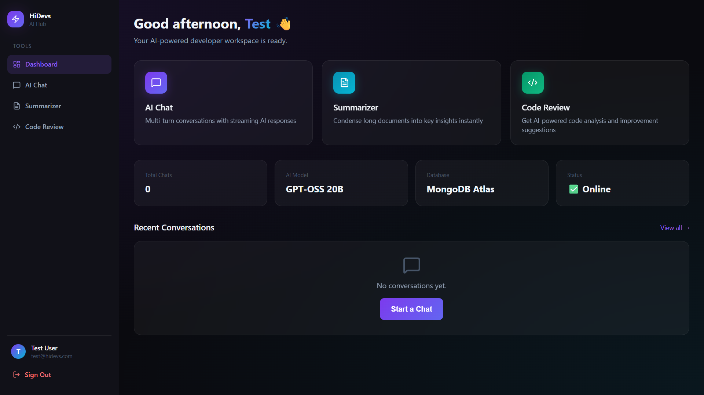
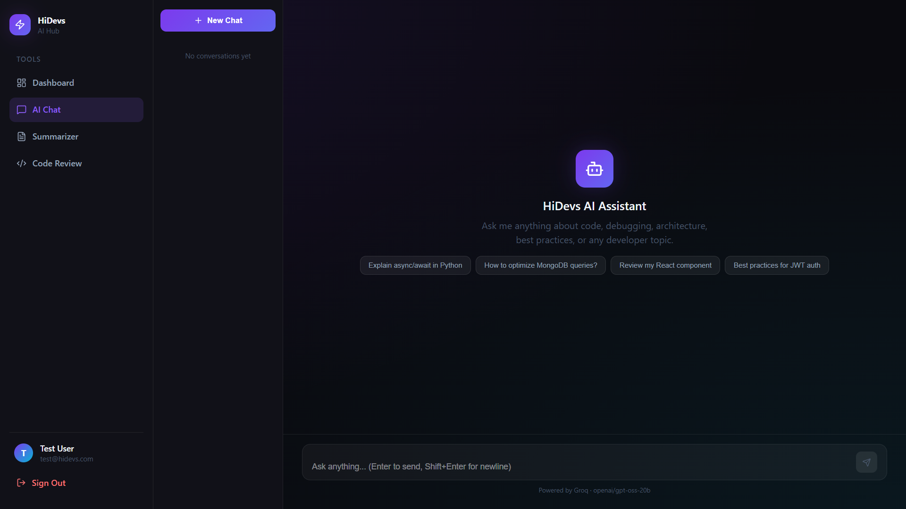
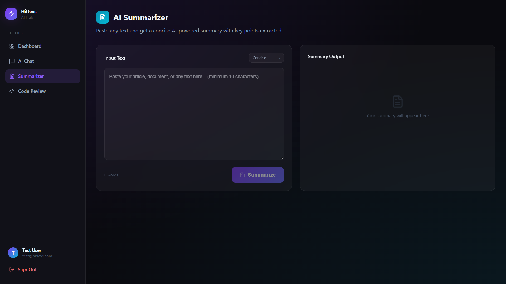
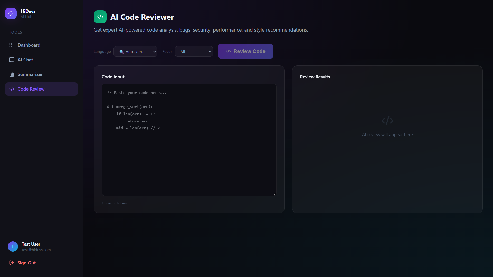
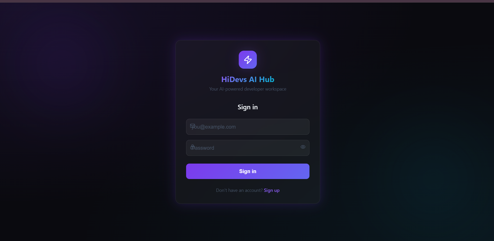

<parameter name="CodeContent"># HiDevs AI Hub 🚀

> **AI-powered developer productivity platform** — Built for the HiDevs Full-Stack AI Engineer Intern Challenge.


---

## ✨ Features

| Feature | Description |
|---|---|
| 🤖 **AI Chat** | Multi-turn conversations with **real-time streaming** (SSE) responses |
| 📄 **Document Summarizer** | Condense long documents — concise / detailed / bullet modes |
| 🔍 **Code Reviewer** | AI analysis: bugs, security, performance & style with score 1–10 |
| 🔐 **Auth System** | JWT access + refresh tokens, bcrypt hashing, protected routes |
| 📊 **Dashboard** | Activity history, recent chats, quick-access tool cards |

---

## 🏗️ Architecture & Tech Stack

```
┌─────────────────────────────────────────────────────────────┐
│                        CLIENT (Browser)                     │
│           React 18 + Vite + TypeScript + Tailwind CSS       │
│   Pages: Login · Register · Dashboard · Chat · Tools        │
└────────────────────────┬────────────────────────────────────┘
                         │ HTTP / SSE (EventSource)
                         ▼
┌─────────────────────────────────────────────────────────────┐
│                    BACKEND  (FastAPI)                       │
│  /api/auth  ·  /api/chat (SSE stream)  ·  /api/tools       │
│  JWT Auth · bcrypt · Motor (async) · Pydantic validation   │
└────────────┬──────────────────────┬────────────────────────┘
             │                      │
             ▼                      ▼
┌────────────────────┐   ┌──────────────────────────────┐
│  MongoDB Atlas     │   │       Groq Cloud API          │
│  (Free M0 Cluster) │   │  Model: openai/gpt-oss-20b   │
│  Users · Convos   │   │  Streaming · Summarize · Review│
└────────────────────┘   └──────────────────────────────┘
```

### Why This Stack?

| Choice | Reason |
|---|---|
| **FastAPI** | Async-native Python framework; `StreamingResponse` makes SSE trivial |
| **Motor** | Async MongoDB driver — non-blocking I/O aligned with FastAPI's event loop |
| **Groq Cloud** | ~10x faster inference than OpenAI for same model class; free tier for dev |
| **JWT (access + refresh)** | Stateless auth; short-lived access tokens + long-lived refresh tokens |
| **SSE over WebSocket** | Simpler for unidirectional AI streaming; no handshake overhead |
| **Tailwind CSS v4** | New Vite plugin mode — zero config, no `tailwind.config.js` needed |
| **React Context** | Lightweight auth state without Redux overhead for this scope |

---

## 💰 Infrastructure Cost Analysis

### Development / Demo (Current Setup)

| Service | Tier | Monthly Cost |
|---|---|---|
| **MongoDB Atlas** | Free M0 (512 MB) | **$0** |
| **Groq Cloud** | Free tier (dev limits) | **$0** |
| **Render** (backend) | Free tier (750 hrs/mo) | **$0** |
| **Render / Vercel** (frontend) | Free tier | **$0** |
| **GitHub Actions** | Free (2000 mins/mo) | **$0** |
| **Total** | | **$0/month** |

### Production Scale (100 active users/day)

| Service | Tier | Monthly Cost (Est.) |
|---|---|---|
| **MongoDB Atlas** | M10 dedicated cluster (10 GB) | ~$57 |
| **Groq Cloud** | Pay-per-token (~$0.59/M tokens) | ~$5–20 depending on usage |
| **Render** (backend, Starter) | 512 MB RAM, always-on | ~$7 |
| **Render / Vercel** (frontend) | Static CDN | $0–20 |
| **GitHub Actions** | Team plan CI/CD | $0 (within limits) |
| **Total** | | **~$70–100/month** |

### Production Scale (10,000 users/day — enterprise)

| Service | Tier | Monthly Cost (Est.) |
|---|---|---|
| **MongoDB Atlas** | M30 + Atlas Search | ~$200 |
| **Groq Cloud** | Volume pricing | ~$100–500 |
| **AWS ECS / GCP Cloud Run** | 2 vCPU, 4 GB RAM, auto-scale | ~$80–150 |
| **CloudFront CDN** | Static assets | ~$5 |
| **Total** | | **~$400–900/month** |

> **Cost optimization strategies**: Cache frequent AI responses in Redis, implement request rate limiting per user, use streaming to reduce perceived latency without larger model sizes.

---

## 📋 Documentation & Process

### Approach

This project was built with a **backend-first, AI-first** approach. The decision to implement AI features through structured prompt engineering (JSON-mode outputs) rather than free-form text means every AI response is predictable, parseable, and gracefully degradable.

The development workflow used **Antigravity (Google DeepMind's AI coding assistant)** as the primary pair-programming tool throughout — for code generation, debugging, architecture decisions, and test generation.

**Key architectural decision — SSE over WebSocket:**
Standard WebSockets require session management and bidirectional channels, which adds complexity for a use case that's inherently one-directional (server streams tokens to client). FastAPI's `StreamingResponse` with `text/event-stream` content type handles this elegantly with 5 lines of code.

**Key architectural decision — MongoDB for conversations:**
Chat history is naturally document-shaped (conversation → messages array). MongoDB's flexible schema lets the message structure evolve (adding metadata, reactions, etc.) without migrations.

### Challenges Faced

1. **`passlib` + `bcrypt v5` incompatibility** — `passlib` expects a `bcrypt.__about__.__version__` attribute that was removed in `bcrypt v5`. Diagnosed from the traceback and fixed by removing `passlib` entirely, using `bcrypt.hashpw()` / `bcrypt.checkpw()` directly. This is a common but poorly documented gotcha in modern Python environments.

2. **SSE metadata at stream end** — After the AI finishes streaming, the frontend needs the `conversation_id` (which is only known after MongoDB creates it) to update the sidebar. Solved by sending a special `[DONE:<conv_id>:<title>]` sentinel as the final SSE event, which the frontend parses to update state without a second HTTP round-trip.

3. **Windows console Unicode encoding** — FastAPI startup prints emoji to stdout; Windows `cp1252` codec can't encode them, crashing the server on startup. Fixed by replacing emoji with ASCII-safe status strings in `database.py`.

4. **Nginx + SSE through Docker** — SSE streams require `proxy_buffering off` and `proxy_cache off` in nginx, otherwise the browser waits for the full response before rendering. Added these directives to `nginx.conf`.

5. **Groq JSON mode reliability** — Groq's `response_format: json_object` sometimes returns valid JSON with missing fields. Every AI service function uses a two-layer fallback: first tries `json.loads()`, then falls back to raw string output, ensuring the API never returns a 500 to the user.

### How to Run

#### Local Development (Recommended for evaluation)

**Prerequisites:** Python 3.11+, Node.js 20+

```bash
# 1. Clone the repo
git clone <your-repo-url>
cd hidevs

# 2. Start the backend
cd backend
pip install -r requirements.txt
uvicorn main:app --reload --port 8000
# → API running at http://localhost:8000
# → Swagger docs at http://localhost:8000/docs

# 3. Start the frontend (new terminal)
cd frontend
npm install
npm run dev
# → App running at http://localhost:5173
```

#### Docker (Production-like)

```bash
# Create root .env from example
cp .env.example .env
# Fill in your credentials in .env

docker-compose up --build
# → App at http://localhost (port 80)
# → API at http://localhost:8000
```

#### Run Tests

```bash
cd backend
pytest tests/ -v
# Expected: 15 passed
```

> **⚠️ Note on Live Demo:** The backend is hosted on Render's free tier. Free instances spin down after inactivity, which can cause the first request to take 50 seconds or more. This is a Render platform limitation — not a code issue. If login appears slow on first load, wait a moment and retry. For a smooth demonstration, please refer to the walkthrough video.

---

## 📡 API Reference

Swagger UI: `http://localhost:8000/docs`

| Method | Endpoint | Auth | Description |
|---|---|---|---|
| POST | `/api/auth/register` | ❌ | Register, returns JWT |
| POST | `/api/auth/login` | ❌ | Login, returns JWT |
| POST | `/api/auth/refresh` | ❌ | Refresh access token |
| GET | `/api/auth/me` | ✅ JWT | Current user info |
| POST | `/api/chat/message` | ✅ JWT | Send message (SSE stream) |
| GET | `/api/chat/history` | ✅ JWT | List all conversations |
| GET | `/api/chat/{id}` | ✅ JWT | Get conversation + messages |
| DELETE | `/api/chat/{id}` | ✅ JWT | Delete conversation |
| POST | `/api/tools/summarize` | ✅ JWT | AI text summarization |
| POST | `/api/tools/code-review` | ✅ JWT | AI code review |

---

## 🔧 Environment Variables

| Variable | Description | Example |
|---|---|---|
| `MONGO_URI` | MongoDB Atlas connection string | `mongodb+srv://...` |
| `DB_NAME` | Database name | `hidevs` |
| `JWT_SECRET` | Secret for JWT signing (32+ chars) | `my_super_secret_key` |
| `JWT_ALGORITHM` | JWT algorithm | `HS256` |
| `ACCESS_TOKEN_EXPIRE_MINUTES` | Access token TTL | `60` |
| `REFRESH_TOKEN_EXPIRE_DAYS` | Refresh token TTL | `7` |
| `GROQ_API_KEY` | Groq Cloud API key | `gsk_...` |
| `GROQ_MODEL` | Model identifier | `openai/gpt-oss-20b` |
| `FRONTEND_URL` | Allowed CORS origin | `https://hidevs.vercel.app` |
| `VITE_API_URL` | Frontend → backend URL (Vercel only) | `https://hidevs.onrender.com/api` |

See `.env.example` for a copyable template.

---

## 🧪 Tests

```bash
cd backend && pytest tests/ -v
```

| Test File | Tests | Coverage |
|---|---|---|
| `test_auth.py` | 9 tests | Password hashing, JWT create/decode/invalid |
| `test_ai_service.py` | 6 tests | Summarize success/fallback, code review success/failure, title gen |
| **Total** | **15 tests** | Business logic + AI service with mocked Groq |

---

## 🐳 Docker

```bash
docker-compose up --build   # Build and start
docker-compose up -d        # Background mode
docker-compose down         # Stop
docker-compose logs -f      # Follow logs
```

Services:
- `hidevs_backend` — FastAPI on port 8000 with health check
- `hidevs_frontend` — nginx serving React build on port 80, proxies `/api` to backend

---

## User Interface

- Dashboard
  
  
  
- AI Assistant

  
  
- AI Summarizer

  
  
- AI Code Reviewer

  

- Login

  

---

## 🌐 Deployment (Render)

1. Push repo to GitHub
2. **Backend Web Service** on Render:
   - Root: `backend/`
   - Build: `pip install -r requirements.txt`
   - Start: `uvicorn main:app --host 0.0.0.0 --port $PORT`
   - Add all env vars from `.env.example`
3. **Frontend Static Site** on Render:
   - Root: `frontend/`
   - Build: `npm install && npm run build`
   - Publish: `dist/`
4. Update `FRONTEND_URL` in backend env to match the deployed frontend URL

---

## 📁 Project Structure

```
hidevs/
├── backend/
│   ├── main.py              # App entrypoint, CORS, lifespan hooks
│   ├── config.py            # Pydantic BaseSettings from .env
│   ├── database.py          # Motor async MongoDB client
│   ├── models/
│   │   ├── user.py          # UserCreate, UserOut, TokenResponse
│   │   └── chat.py          # Message, Conversation, Summarize/CodeReview I/O
│   ├── routers/
│   │   ├── auth.py          # /register /login /refresh /me
│   │   ├── chat.py          # SSE streaming, history, delete
│   │   └── tools.py         # /summarize /code-review
│   ├── services/
│   │   ├── auth_service.py  # bcrypt hashing + JWT utilities
│   │   └── ai_service.py    # Groq client: chat stream, summarize, review
│   ├── tests/
│   │   ├── test_auth.py
│   │   └── test_ai_service.py
│   ├── Dockerfile
│   ├── requirements.txt
│   └── pytest.ini
├── frontend/
│   ├── src/
│   │   ├── pages/           # Login, Register, Dashboard, Chat, Summarize, CodeReview
│   │   ├── components/      # Sidebar, ProtectedRoute
│   │   ├── context/         # AuthContext (JWT persistence + refresh)
│   │   ├── services/        # Axios instance with JWT interceptors
│   │   └── index.css        # Full design system (CSS variables, animations)
│   ├── nginx.conf           # React Router + SSE-capable API proxy
│   └── Dockerfile           # Multi-stage: Node build → nginx serve
├── .github/workflows/ci.yml # pytest + tsc build + docker build on push
├── docker-compose.yml
├── .env.example
└── README.md
```

---

## 🤖 Built with Antigravity AI

This project was built using **Antigravity** (Google DeepMind's AI coding assistant) as the primary development tool — demonstrating real-world AI-assisted engineering for architecture design, code generation, debugging (e.g., the bcrypt/passlib incompatibility), test writing, and documentation.

---

## 📜 License

MIT License - See LICENSE file for details
